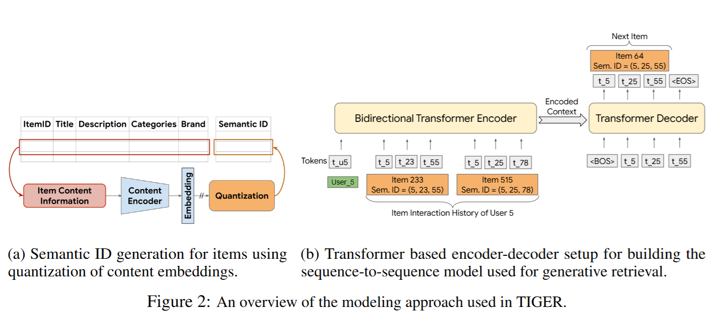

# TIGER
This is an Unofficial Pytorch Implementation for the paper:

>[Recommender Systems with Generative Retrieval](https://arxiv.org/pdf/2305.05065)

# Model Architecture

# Data Preprocess

Step 1: Decompress the downloaded 5-core reviews and metadata from [Amazon Review 2014](https://cseweb.ucsd.edu/~jmcauley/datasets/amazon/links.html), which are in the format `reviews_Beauty_5.json.gz` and `meta_Beauty.json.gz`. Use the command provided in the `TIGER/data/process.ipynb` file to perform the decompression.

Step 2: Use `main.py` in `TIGER/rqvae` folder to train a rqvae model using semantic embeddings obtained in Step 1.

Step 3: Use `generate_code.py` in `TIGER/rqvae` folder to select the best model to generate discrete code for semantic embeddings in Step 1 and padding at the last position to resolve duplicate codes.

# Train a T5 encoder-decoder model

Use `main.py` in `TIGER/model` folder to train a T5 encoder-decoder model with semantic code.

# Experimental Results
<table>
  <tr>
    <th rowspan="2">Metric</th>
    <th colspan="2">Beauty</th>
    <th colspan="2">Sports</th>
    <th colspan="2">Toys</th>
  </tr>
  <tr>
    <th>Ours</th>
    <th>Paper</th>
    <th>Ours</th>
    <th>Paper</th>
    <th>Ours</th>
    <th>Paper</th>
  </tr>
  <tr>
    <td>Recall@5</td>
    <td>0.0392</td>
    <td>0.0454</td>
    <td>0.0233</td>
    <td>0.0264</td>
    <td>0.0396</td>
    <td>0.0521</td>
  </tr>
  <tr>
    <td>Recall@10</td>
    <td>0.0594</td>
    <td>0.0648</td>
    <td>0.0379</td>
    <td>0.0400</td>
    <td>0.0577</td>
    <td>0.0712</td>
  </tr>
  <tr>
    <td>NDCG@5</td>
    <td>0.0257</td>
    <td>0.0321</td>
    <td>0.0150</td>
    <td>0.0181</td>
    <td>0.0270</td>
    <td>0.0371</td>
  </tr>
  <tr>
    <td>NDCG@10</td>
    <td>0.0321</td>
    <td>0.0384</td>
    <td>0.0197</td>
    <td>0.0225</td>
    <td>0.0328</td>
    <td>0.0432</td>
  </tr>
</table>

# References
[Recommender Systems with Generative Retrieval](https://arxiv.org/pdf/2305.05065)

[Adapting Large Language Models by Integrating Collaborative Semantics for Recommendation](https://ieeexplore.ieee.org/stamp/stamp.jsp?tp=&arnumber=10597986)
